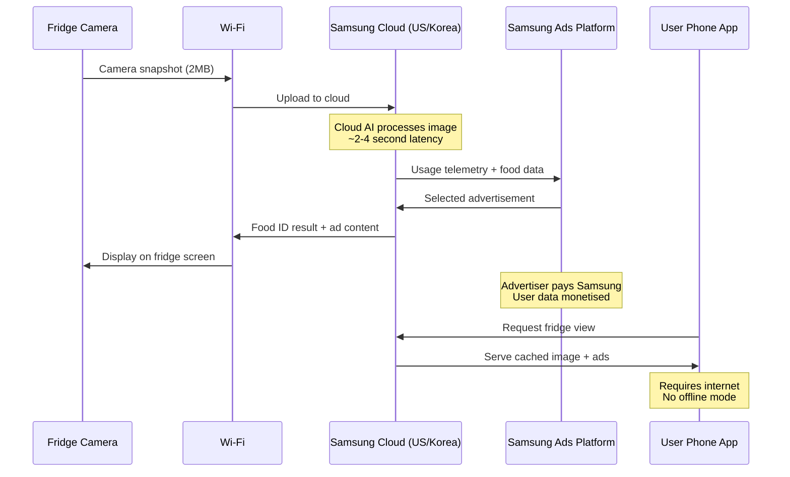
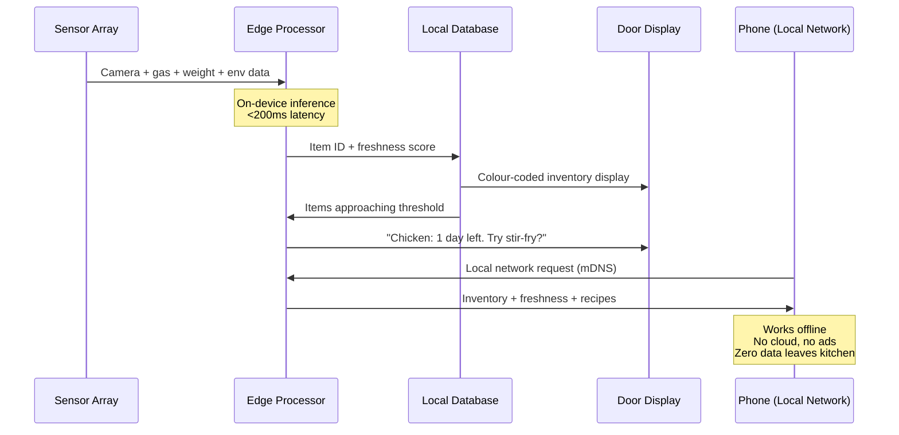

# Figure 3: Data Flow Comparison — Prior Art vs GRANNY

## Prior Art (Samsung Family Hub)

```mermaid
sequenceDiagram
    participant F as Fridge Camera
    participant W as Wi-Fi
    participant C as Samsung Cloud (US/Korea)
    participant A as Samsung Ads Platform
    participant P as User Phone App

    F->>W: Camera snapshot (2MB)
    W->>C: Upload to cloud
    Note over C: Cloud AI processes image<br/>~2-4 second latency
    C->>A: Usage telemetry + food data
    A->>C: Selected advertisement
    C->>W: Food ID result + ad content
    W->>F: Display on fridge screen
    Note over A: Advertiser pays Samsung<br/>User data monetised

    P->>C: Request fridge view
    C->>P: Serve cached image + ads
    Note over P: Requires internet<br/>No offline mode
```

## GRANNY (Edge-First Architecture)

```mermaid
sequenceDiagram
    participant S as Sensor Array
    participant E as Edge Processor
    participant D as Local Database
    participant U as Door Display
    participant P as Phone (Local Network)

    S->>E: Camera + gas + weight + env data
    Note over E: On-device inference<br/><200ms latency
    E->>D: Item ID + freshness score
    D->>U: Colour-coded inventory display
    D->>E: Items approaching threshold
    E->>U: "Chicken: 1 day left. Try stir-fry?"

    P->>E: Local network request (mDNS)
    E->>P: Inventory + freshness + recipes
    Note over P: Works offline<br/>No cloud, no ads<br/>Zero data leaves kitchen
```
