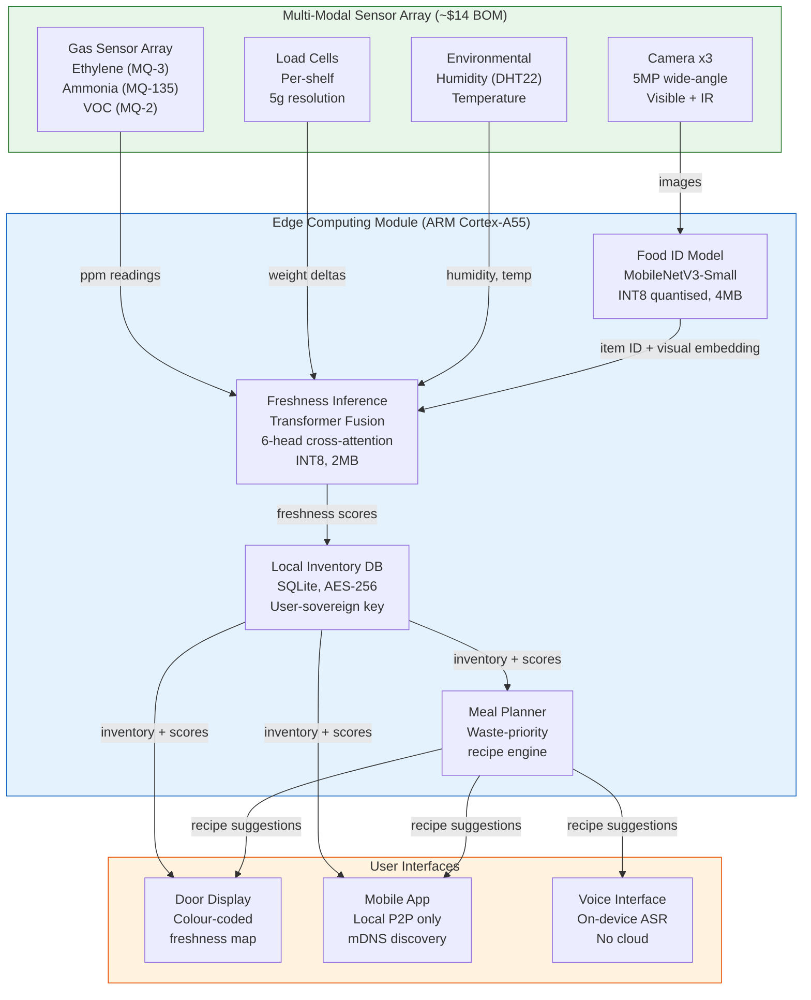

# Figure 1: GRANNY System Architecture

```mermaid
graph TB
    subgraph SENSORS["Multi-Modal Sensor Array (~$14 BOM)"]
        CAM["Camera x3<br/>5MP wide-angle<br/>Visible + IR"]
        GAS["Gas Sensor Array<br/>Ethylene (MQ-3)<br/>Ammonia (MQ-135)<br/>VOC (MQ-2)"]
        WEIGHT["Load Cells<br/>Per-shelf<br/>5g resolution"]
        ENV["Environmental<br/>Humidity (DHT22)<br/>Temperature"]
    end

    subgraph EDGE["Edge Computing Module (ARM Cortex-A55)"]
        FOODID["Food ID Model<br/>MobileNetV3-Small<br/>INT8 quantised, 4MB"]
        FRESH["Freshness Inference<br/>Transformer Fusion<br/>6-head cross-attention<br/>INT8, 2MB"]
        MEAL["Meal Planner<br/>Waste-priority<br/>recipe engine"]
        DB["Local Inventory DB<br/>SQLite, AES-256<br/>User-sovereign key"]
    end

    subgraph UI["User Interfaces"]
        DISPLAY["Door Display<br/>Colour-coded<br/>freshness map"]
        APP["Mobile App<br/>Local P2P only<br/>mDNS discovery"]
        VOICE["Voice Interface<br/>On-device ASR<br/>No cloud"]
    end

    CAM -->|"images"| FOODID
    GAS -->|"ppm readings"| FRESH
    WEIGHT -->|"weight deltas"| FRESH
    ENV -->|"humidity, temp"| FRESH
    FOODID -->|"item ID + visual embedding"| FRESH
    FRESH -->|"freshness scores"| DB
    DB -->|"inventory + scores"| MEAL
    DB -->|"inventory + scores"| DISPLAY
    DB -->|"inventory + scores"| APP
    MEAL -->|"recipe suggestions"| DISPLAY
    MEAL -->|"recipe suggestions"| APP
    MEAL -->|"recipe suggestions"| VOICE

    style SENSORS fill:#e8f5e9,stroke:#2e7d32
    style EDGE fill:#e3f2fd,stroke:#1565c0
    style UI fill:#fff3e0,stroke:#e65100
```
